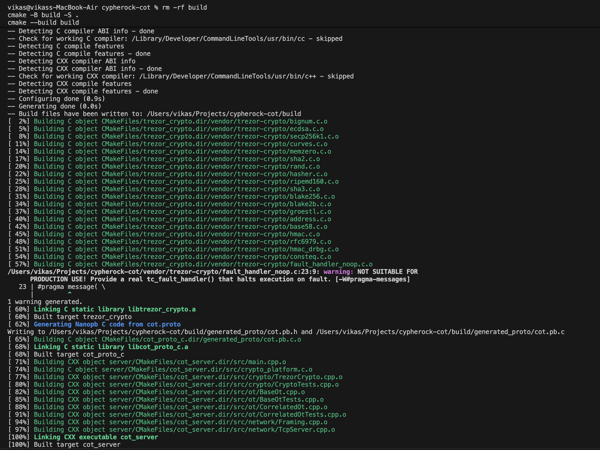
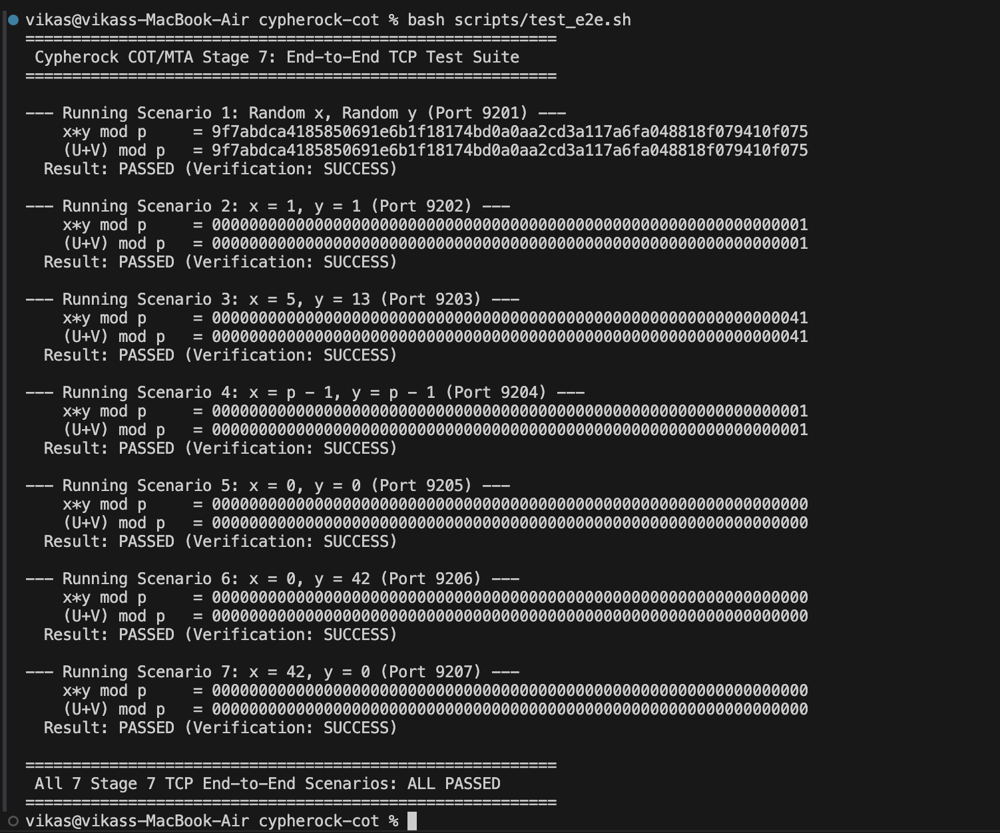
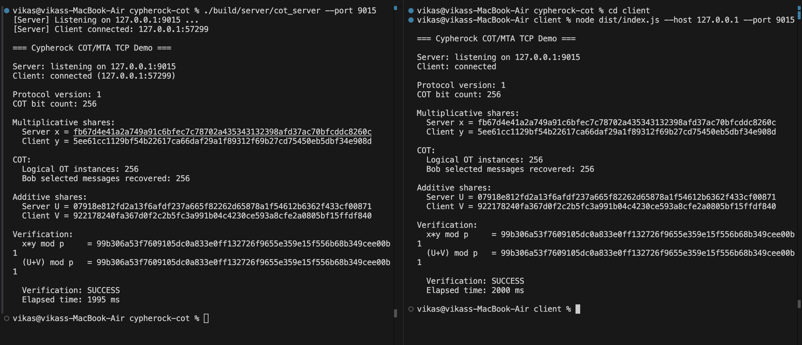
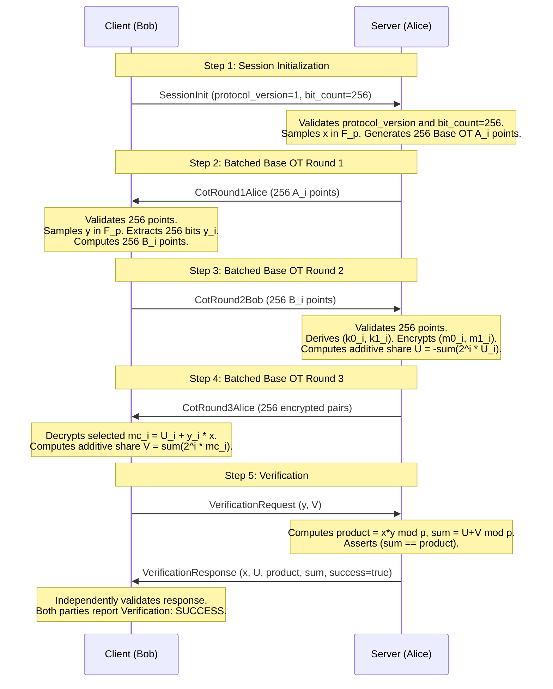

# Cypherock Correlated Oblivious Transfer (COT) & MTA Implementation

This repository implements the mock Cypherock Correlated Oblivious Transfer (COT) and Multiplication-to-Addition (MTA) protocol specified in [`docs/COT.pdf`](docs/COT.pdf) (Appendix A.3.1 – A.3.3).

The system generates additive secret shares $(U, V)$ of a 256-bit scalar multiplication $(x \cdot y)$ over the secp256k1 base field $\mathbb{F}_p$:
$$(U + V) \equiv (x \cdot y) \pmod p$$
where:
- **Server (Alice)** holds multiplicative term $x \in \mathbb{F}_p$ and computes additive share $U \in \mathbb{F}_p$.
- **Client (Bob)** holds multiplicative term $y \in \mathbb{F}_p$ and computes additive share $V \in \mathbb{F}_p$.

The implementation runs over localhost TCP using length-prefixed Protocol Buffer framing.

---

## 1. Prerequisites & Environment

- **Operating System**: macOS (Apple Silicon arm64 / Darwin 24.x)
- **C++ Compiler**: Apple Clang 21.0.0+ (C++17)
- **Build System**: CMake 3.31+
- **C++ Dependencies**:
  - Boost 1.92.0+ (`Boost::headers`)
  - Nanopb 0.4.9.2 (`nanopb_generator` / `protobuf-nanopb-static`)
  - Protobuf Compiler (`protoc 36.0+`)
  - Upstream SatoshiLabs `trezor-firmware/crypto` (audited closure vendored under `vendor/trezor-crypto/`)
- **TypeScript / Node.js**:
  - Node.js 20.20.2+
  - npm 10.8.2+
  - TypeScript 5.7.3+
  - `protobufjs` 7.4.0+

---

## 2. Architecture & Project Layout

```
cypherock-cot/
├── docs/
│   └── COT.pdf                   # Specification authority (Appendix A.3)
├── proto/
│   ├── cot.proto                 # Single source-of-truth Protobuf schema
│   └── cot.options               # Nanopb static memory configuration
├── server/                       # C++ Server (Alice)
│   ├── CMakeLists.txt
│   ├── include/
│   │   ├── crypto/TrezorCrypto.hpp
│   │   ├── network/Framing.hpp
│   │   ├── network/TcpServer.hpp
│   │   ├── ot/BaseOt.hpp
│   │   └── ot/CorrelatedOt.hpp
│   └── src/
│       ├── main.cpp
│       ├── crypto_platform.c     # macOS CSPRNG arc4random_buf bridge
│       ├── crypto/TrezorCrypto.cpp
│       ├── network/Framing.cpp
│       ├── network/TcpServer.cpp
│       ├── ot/BaseOt.cpp
│       └── ot/CorrelatedOt.cpp
├── client/                       # TypeScript Client (Bob)
│   ├── package.json
│   ├── tsconfig.json
│   └── src/
│       ├── index.ts
│       ├── crypto/NodeCrypto.ts
│       ├── crypto/PointMath.ts
│       ├── network/Framing.ts
│       ├── network/TcpClient.ts
│       ├── ot/BaseOt.ts
│       └── ot/CorrelatedOt.ts
├── scripts/
│   └── test_e2e.sh               # Automated 7-scenario TCP test runner
├── vendor/
│   └── trezor-crypto/            # Audited Trezor crypto C source tree
├── CMakeLists.txt                # Root CMake build file
└── README.md
```

---

## 3. Build Instructions

### Server (C++)
```bash
rm -rf build
cmake -B build -S .
cmake --build build
```
The compiled executable is placed at `./build/server/cot_server`.

### Client (TypeScript)
```bash
cd client
npm install       # First time only
npm run build
```
The compiled JavaScript is placed at `client/dist/index.js`.



---

## 4. Testing Commands

### A. Independent Unit Tests (`--test-only`)

Both the C++ server and TypeScript client include comprehensive standalone unit test suites that exercise:
- Stage 3: TCP framing parser (chunked, split, concatenated, oversized frame rejection)
- Stage 4: Cryptographic primitives (CSPRNG, SHA-256, scalar validation, point multiplication, affine point addition, field arithmetic)
- Stage 5: Base OT protocol logic ($c=0$, $c=1$, negative tests, wrong-key decryption checks)
- Stage 6: Correlated OT & MTA algebra (deterministic cases, zero cases, boundary $p-1$, 5 random runs)

Run the C++ unit tests:
```bash
./build/server/cot_server --test-only
```

Run the TypeScript unit tests:
```bash
cd client
node dist/index.js --test-only
```

### B. Automated End-to-End TCP Test Suite (All 7 Scenarios)

An automated script executes the complete protocol over real TCP sockets across all seven required scenarios:
1. Scenario 1: Random $x \in \mathbb{F}_p$, Random $y \in \mathbb{F}_p$
2. Scenario 2: $x = 1, y = 1$
3. Scenario 3: $x = 5, y = 13$
4. Scenario 4: $x = p - 1, y = p - 1$
5. Scenario 5: $x = 0, y = 0$
6. Scenario 6: $x = 0, y = 42$
7. Scenario 7: $x = 42, y = 0$

Execute the test suite:
```bash
./scripts/test_e2e.sh
```



---

## 5. Running the End-to-End TCP Demo Manually

Open two terminal windows:

### Terminal 1 (Start Server / Alice):
```bash
# Default mode: random x
./build/server/cot_server --port 9000

# Or run with a deterministic test case (e.g. case 3: x = 5, y = 13):
./build/server/cot_server --port 9000 --case 3
```

### Terminal 2 (Start Client / Bob):
```bash
cd client
# Default mode: random y
node dist/index.js --port 9000

# Or matching test case (e.g. case 3):
node dist/index.js --port 9000 --case 3
```



### Expected Output
```text
=== Cypherock COT/MTA TCP Demo ===

Server: listening on 127.0.0.1:9000
Client: connected (127.0.0.1:54321)

Protocol version: 1
COT bit count: 256

Multiplicative shares:
  Server x = 5bc4567b17fdeaa9f9ff77b155f9d9f88e8925ea9981244d8e4f9973715fe52f
  Client y = 69abc38e735a3dd97e349c5e548a45279d0627ee8b5376c830050b3cf1e45d6f

COT:
  Logical OT instances: 256
  Bob selected messages recovered: 256

Additive shares:
  Server U = 471b69c96f2f1c2da1e92cd1f120a2907c85a5f2638099e8b7e98d27ec6d19d2
  Client V = 445fe57e8c28641be5d644d15dbb68728701c351d130764085228185df6a2710

Verification:
  x*y mod p     = 8b7b4f47fb57804987bf71a34edc0b030387694434b110293d0c0eadcbd740e2
  (U+V) mod p   = 8b7b4f47fb57804987bf71a34edc0b030387694434b110293d0c0eadcbd740e2

  Verification: SUCCESS
  Elapsed time: 2135 ms
```

---

## 6. Cryptographic Architecture & Domain Separation

### Modulus Separation: Field Prime $p$ vs Curve Order $n$

The protocol strictly separates the two secp256k1 moduli:

1. **secp256k1 Field Prime $p$**:
   $$p = 2^{256} - 2^{32} - 977 = \text{0xFFFFFFFFFFFFFFFFFFFFFFFFFFFFFFFFFFFFFFFFFFFFFFFFFFFFFFFEFFFFFC2F}$$
   - Defines the finite field $\mathbb{F}_p$ over which EC point coordinates $(x_P, y_P)$ are defined.
   - **Used exclusively for**: Multiplicative terms $x, y \in \mathbb{F}_p$, additive shares $U, V \in \mathbb{F}_p$, random masks $U_i \in \mathbb{F}_p$, correlated messages $m_{0, i}, m_{1, i}, mc_i \in \mathbb{F}_p$, powers of two $2^i \bmod p$, and secret product verification $(x \cdot y) \bmod p$.
   - Valid range: $0 \le v < p$.

2. **secp256k1 Curve Order $n$**:
   $$n = \text{0xFFFFFFFFFFFFFFFFFFFFFFFFFFFFFFFEBAAEDCE6AF48A03BBFD25E8CD0364141}$$
   - Defines the order of the base generator point $G$, such that $n \cdot G = \mathcal{O}$.
   - **Used strictly and exclusively for**: Validating ephemeral EC private scalars $a_i, b_i \in [1, n-1]$ used in Base OT Diffie-Hellman point multiplication.
   - $n$ is **never** used for $x, y, U, V, U_i, m0, m1,$ or $mc$.

---

## 7. Protocol Sequence & Implementation Details

### A. Base OT (Appendix A.3.1)

For each bit $i \in [0, 255]$:
1. Alice generates ephemeral scalar $a_i \in [1, n-1]$ and computes $A_i = a_i \cdot G$.
2. Bob generates ephemeral scalar $b_i \in [1, n-1]$, receives $A_i$, and computes:
   $$B_i = b_i \cdot G \quad (\text{if } c_i = 0), \qquad B_i = b_i \cdot G + A_i \quad (\text{if } c_i = 1)$$
3. Alice receives $B_i$ and derives two symmetric keys from the $X$-coordinates:
   $$k_{0, i} = (a_i \cdot B_i)_x, \qquad k_{1, i} = (a_i \cdot (B_i - A_i))_x$$
4. Bob derives his selection key:
   $$k_{c, i} = (b_i \cdot A_i)_x$$
   Algebraic equality guarantees:
   - If $c_i = 0$: $k_{0, i} = (a_i b_i G)_x = k_{c, i}$
   - If $c_i = 1$: $k_{1, i} = (a_i (b_i G + A_i - A_i))_x = (a_i b_i G)_x = k_{c, i}$
5. Alice encrypts $m_{0, i}$ under $k_{0, i}$ and $m_{1, i}$ under $k_{1, i}$.
6. Bob decrypts $e_{c_i, i}$ using $k_{c, i}$ and recovers $mc_i$. Bob never learns the unselected message.

### B. Concrete Symmetric Encryption / Masking Instantiation

> *Note: COT.pdf Appendix A.3.1 specifies that Alice encrypts $m_0$ with $k_0$ and $m_1$ with $k_1$, but leaves the concrete symmetric encryption scheme unspecified. For this mock assignment, the following explicit masking instantiation is used:*

1. Derive a 32-byte mask:
   $$\text{mask}_{c} = \text{SHA256}(k_{c} \parallel \text{uint32\_be}(c)) \bmod p$$
2. Encrypt:
   $$e_{c} = (m_{c} + \text{mask}_{c}) \bmod p$$
3. Decrypt:
   $$m_{c} = (e_{c} - \text{mask}_{c}) \bmod p$$

### C. Correlated OT (COT) & MTA (Appendix A.3.2 & A.3.3)

To multiply $x, y \in \mathbb{F}_p$:
1. Bob decomposes $y$ into 256 bits $y_0, y_1, \dots, y_{255}$ with bit 0 as the **least-significant bit (LSB)**:
   $$y = \sum_{i=0}^{255} 2^i \cdot y_i$$
2. For each bit $i \in [0, 255]$:
   - Alice samples fresh random $U_i \in \mathbb{F}_p$.
   - Alice sets correlated messages:
     $$m_{0, i} = U_i, \qquad m_{1, i} = (U_i + x) \bmod p$$
   - Bob sets choice bit $c_i = y_i$.
   - Base OT executes: Bob recovers $mc_i = U_i + y_i \cdot x \bmod p$.
3. **Derivation of Additive Shares**:
   - Alice computes:
     $$U = - \sum_{i=0}^{255} 2^i \cdot U_i \pmod p$$
   - Bob computes:
     $$V = \sum_{i=0}^{255} 2^i \cdot mc_i \pmod p$$
4. **Invariant Proof**:
   $$V = \sum_{i=0}^{255} 2^i (U_i + y_i x) = \sum_{i=0}^{255} 2^i U_i + x \sum_{i=0}^{255} 2^i y_i = -U + x \cdot y \pmod p$$
   $$(U + V) \equiv (x \cdot y) \pmod p$$

---

## 8. Transport Framing & Protobuf Serialization

### A. TCP Length-Prefix Framing
TCP is a byte-stream protocol without inherent message boundaries. To ensure robust framing across fragmented packets and coalesced reads, all messages are framed with:
```
+-----------------------------+------------------------------------+
| 4-byte Length (Big-Endian)  | Protobuf Payload (`CotEnvelope`)   |
| uint32_t (e.g. 0x00002104)  | N bytes of serialized protobuf     |
+-----------------------------+------------------------------------+
```
- **Frame Parser**: Accumulates incoming byte fragments until the 4-byte header is satisfied, decodes the big-endian `payload_len`, and defers message dispatch until exactly `payload_len` bytes are buffered.
- **Security Boundaries**: Maximum permissible frame size is capped at 1 MB (`MAX_PAYLOAD_SIZE = 1,048,576 bytes`) to prevent memory exhaustion from malformed headers.

### B. Protobuf Schema & Fixed Sizing (`cot.proto` & `cot.options`)
The single source of truth for the wire contract is `proto/cot.proto`:
- **`CotEnvelope`**: Top-level wrapper utilizing a `oneof msg` union ensuring type-safe message demultiplexing.
- **Cryptographic Types**: All scalars and shares are represented as fixed 32-byte raw byte strings (`bytes`, length 32). All compressed elliptic curve points are represented as 33-byte byte strings (`bytes`, length 33).
- **Batching**: The 256 OT instances are batched into a single round:
  - `CotRound1Alice`: Repeated 256 compressed EC points $A_i$ (33 bytes each).
  - `CotRound2Bob`: Repeated 256 compressed EC points $B_i$ (33 bytes each).
  - `CotRound3Alice`: Repeated 256 ciphertext pairs $(e_{0, i}, e_{1, i})$ (32 bytes each).
- **Nanopb Static Allocation**: `proto/cot.options` explicitly enforces `max_size` and `max_count` bounds, allowing deterministic, zero-heap or bounded static memory decoding on the C++ server.

---

## 9. Network Protocol State Machine

Communication between Server and Client is batched into 4 high-level round-trip messages:


